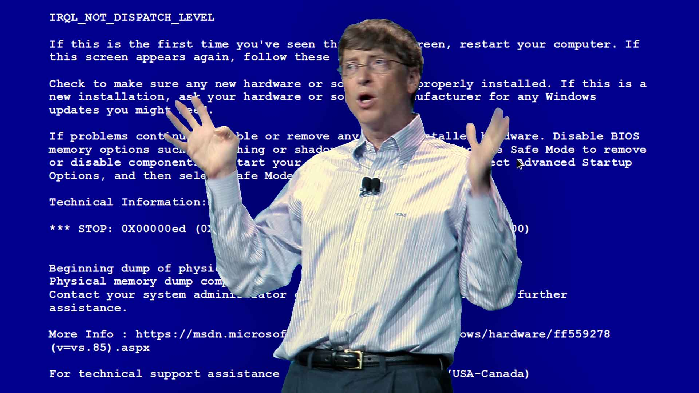
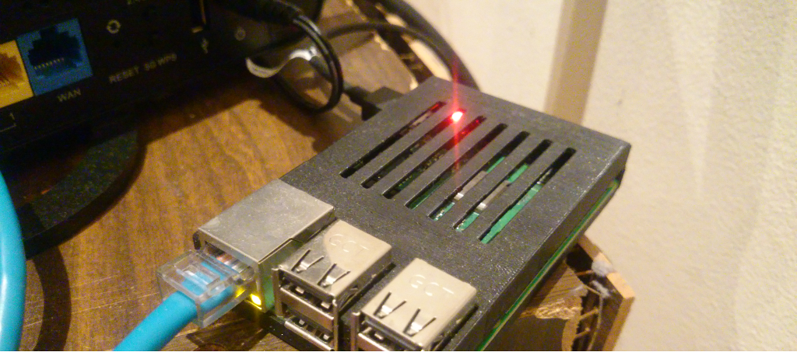
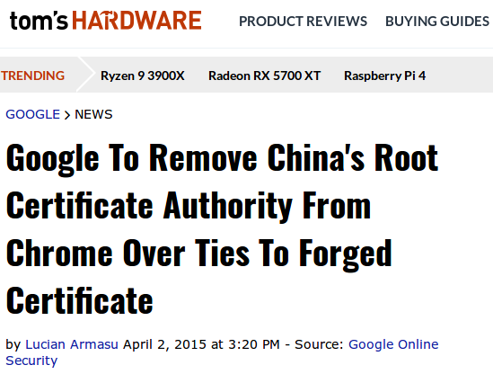
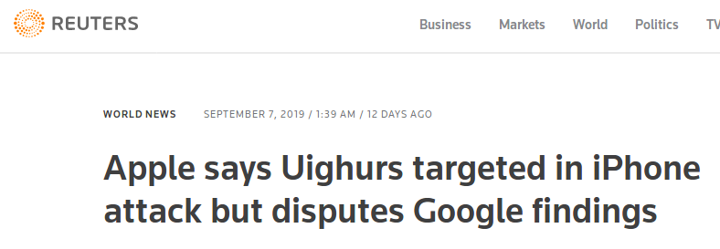
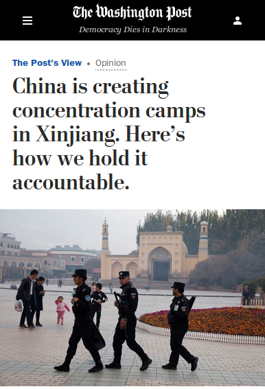
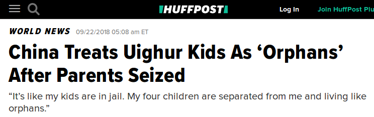
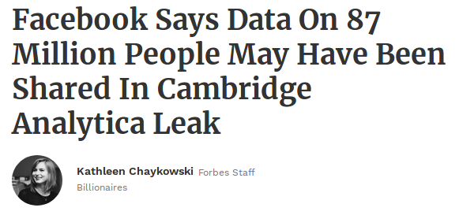
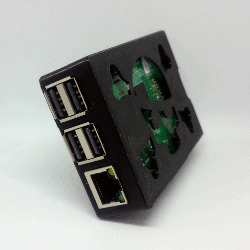
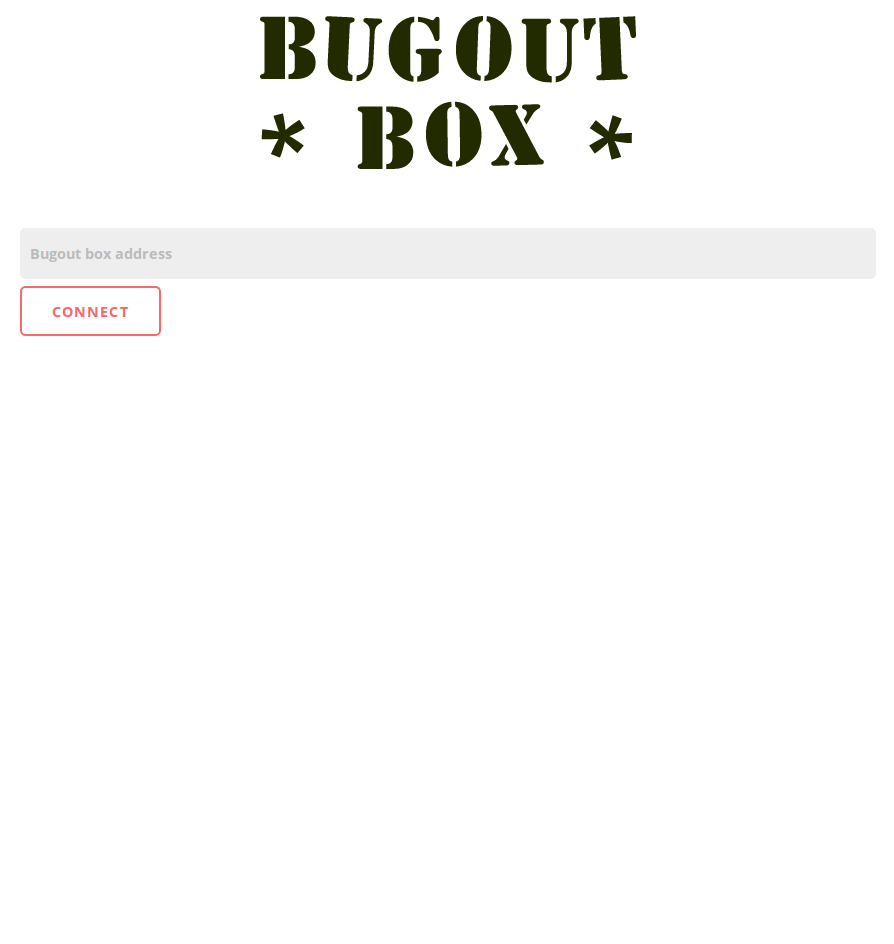

Talk: [BSides] Bugout: practical decentralization on the modern web.

# [bugout.network](https://bugout.network/)


### Practical decentralization on the modern web.

 * Chris McCormick
 * chris@mccormick.cx
 * @mccrmx

???

Hello, my name is Chris. Thanks for coming to listen to me speak today. I'm going to talk about some decentralized web technology I've been experimenting with recently. You can find me and the decentralization work I'm doing at bugout.network. I've got a newsletter you can sign up to there to follow along with what I'm doing.

---

# Today's menu

* [Intro & demo](#intro-and-demo)
* [How to build your own](#build-your-own)
* [Why decentralize?](#why-decentralize)
* [What else can we do with this?](#what-else-can-we-do-with-this)
* [Limitations](#limitations)
* [Bugout box announcement](#bugout-box)

???

Here's what I'm going to cover today. I'm going to start with a demo.

---



???

What could possibly go wrong.

---

# Today's menu

* [Intro & demo](#intro-and-demo)
* [How to build your own](#build-your-own)
* [Why decentralize?](#why-decentralize)
* [What else can we do with this?](#what-else-can-we-do-with-this)
* [Limitations](#limitations)
* [Bugout box announcement](#bugout-box)

???

Then I'm going to show you how to build your own stuff using the same tech I've used. Then after looking at the why, I'm going to go off into la la land and create a bunch of vapourware that I think could & should exist, but doesn't. Then I'm going to discuss the limitations, criticisms, and issues with this tech. Then at the end I've got a bit of an announcement.

Ok this is a lot to cover so let's get cracking.

---

# Intro and demo


???

In a few minutes I'm going to show you code that is working, and code that you can use to build decentralized web things yourself, but really this talk is a science fiction talk.

It's about how things could look, and how I hope they will look in the future on the web. I've built some proof-of-concept stuff here to convince myself and others that what I'm about to describe could be real, but widespread adoption of these models of computing are years away if I'm even correct that they are the future.

---

# my living room



???

Now I want to show you something. There is only a single instance of what I'm going to show you in the whole world right now, but my talk is really about convincing you that a lot more people might be running this type of thing in the future, and why that would be a good thing, and how we can make it happen.

This is a photo of a Raspberry Pi sitting in my living room at home right now, just around the corner.

---

<https://chr15m.github.io/bugout/examples/messageboard.html>


???

If you go to this URL you will see a simple messageboard.

A message board back end is pretty simple. Fundamentally a message board service reads some data - the list of posts, and it writes some data - new posts, and it talks to browsers to let people do that. Usually the backend to a piece of web software like this would run on a VPS server out there - a virtual Linux box at some huge data warehousing service provider.

Let's check out this messageboard.

Nothing amazing right? Pretty awful actually, who designed this?

We can type in a message and hit "send" and then see it appear on the board. If we refresh the message is there.

What is a bit different with this particular message board is where that data lives and how the data gets to you, the end user. What is going on here is that my browser, here in this lecture theatre, is connecting peer-to-peer to the message board backend, which isn't running on some cloud VPS somewhere, but rather, is running in my living room, on that raspberry pi.

---

# my living room


???

And further to that, the backend running on this raspberry pi, the server underlying the messageboard, is actually also running in a browser tab, in a browser running on this Pi.

I can click here where it says "fire up your own copy", and stand up a new messageboard server simply by opening a new browser tab. Now I have a new server running right here in this room, on my laptop, in this browser tab. And you can connect to this - anyone in this room can put in the address for this new message board running in my browser tab on my laptop, and post a message. Your message won't be stored in the cloud somewhere on somebody else's computer, but right here on my laptop in my browser.

Let's open the client in another tab to see any messages coming in.

My cousin is here today - Nick would you connect and post a message to this server I just started, just to demonstrate it's legit?

While Nick does that I'll continue.

---

# what does this mean? 


???

What this means is I have physical sovereignty over the data on the message board. You could do the same kind of thing with SSH tunnels and whatnot, but what I think is really exciting about this is that it really is browser to browser communication. You don't need any backend fiddling, anybody can visit that tab and create a messageboard server.

I'm interested in the "self-hosting" movement as a model of computing where we go back to users controlling the software they run and the data they store, instead of big corporations.

It's easy for us tech people to run backend services on VPS computers and set up SSL certs etc. but I started thinking about what it would take to make that easier for ordinary people. What if you could run web app servers as easily as you run apps on your phone?

---

# what does this mean?


???

What if it was so easy your Mum and Dad could launch their own servers simply by opening a browser tab. What kinds of servers would they run, and what new modes of user-centric computing could we enable?

---

# Build your own


???

Now you've seen that it's possible to build programs, like our messageboard, which run in the browser and talk to other programs which run in other browsers - peer to peer, browser to browser.

This is made possible because of WebRTC which you have probably heard of, and WebTorrent, which you may not have heard of. My own library, Bugout, is a networking and cryptography layer built on top of WebTorrent. It helps browser nodes find and talk to eachother in a simple and hopefully secure way.

When you torrent things these days you do so based on a cryptographic hash of the files called an infoHash. What Bugout does is to treat those infoHashes as chat rooms, and each Bugout node has its own key pair which they use to cryptographically authenticate each other and encrypt the messages sent between nodes.

---

# Build your own


### "build a decentralized web chat in 15 minutes"

???

So that's enough of the theory, how can you use Bugout to build your own decentralized web things? I'll show you now. This is all documented online and if you do a search for "build a decentralized web chat in 15 minutes" you'll find this.

---

# Build your own

```html
<script
  src="https://chr15m.github.io/bugout/bugout.min.js" 
  type="application/javascript">
</script>
```

???

You start with a basic boilerplate index.html file. The first thing you're going to need is to load the library.

If you are a frontend guru and you know how to use node and webpack and stuff like that you can `npm install bugout` and require it, but here we're going to cover doing this without any tooling, just a text editor and a browser.

---

# Build your own

```javascript
var b = Bugout();
```

???

Once you have the library loaded into your HTML document, you can open a new script tag and create a Bugout instance in JavaScript like this. Every Bugout node has an address which we can ask it for.

---

# Build your own

```javascript
b.address();
```

Example:

```
bKpdPiLJjPmwrYWoZYXVWbJFcEMUpfh6BN
```

???

The address ends up as a Base58 encoded string starting with the letter "b". You might notice this address looks a bit like a Bitcoin address. That's because Bugout uses a similar type of cryptographic hashing to create its address from an internal cryptographic keypair. I copied this technique over directly from Bitcoin.

When you instantiate a Bugout instance it will start reaching out into the network making itself available to other instances in the same room, using the same room hash. In the instantation above we haven't provided a room to connect to and so the default is to connect to a room named after the node's own address.

---

# Build your own

```javascript
var b = Bugout("1337 secret h4x0r room");
```

???

If you want to connect to a room instead you can pass a parameter to the Bugout instance. Here you can see we're instructing our Bugout instance to connect to a room called "elite secret hacker room".

This is a global room and all instances worldwide which use the same room name will connect to the same room.

---

# Build your own

```javascript
b.on("seen", function(address) {
  console.log("seen " + address);
});

b.on("message", function(address, message) {
  console.log(address + ": " + message);
});
```

???

Once your instance is connected it can listen out for messages from other nodes by binding event handlers.

The first callback here will fire whenever a new peer node is seen by our node. The second one will fire whenever a message is received by our node.

Messages can still get through from peers in the same room even if our peer hasn't directly connect to them because there is a gossip protocol whereby nodes in the same room re-share everything they receive. So the network is quite tolerant of indirect connections and poor networks.

---

# Build your own

```javascript
b.send("hello world!");
```

???

Finally you want to be able to send messages yourself.

The `send` method will send a message to all Bugout nodes in browser tabs around the world which are connected to the same room as your node.

These are the simple components that the message board demo is built on and what you need to get browsers talking to eachother without any internet servers in between. There's a bunch of other stuff Bugout does like RPC but that is the core functionality and it enables the main thing which is browsers talking to eachother in a decentralized peer-to-peer way.

---

# Build your own

### "build a decentralized web chat in 15 minutes"

???

Again if you want to go through that quick tutorial in your own time search for "build a decentralized web chat in 15 minutes".

---

# Why decentralize?

???

So that's the how. I've shown you one way to build something for the web in a way that is quite decentralized.

There are a bunch of caveats and limitations and room for improvement that I will get to soon, but before we do that I want to talk about why decentralization even matters, and once we accept that it does matter, what kinds of things we can build with this new superpower.

So the first question is why? Why is this way of doing things good and useful?

You might reasonably argue that it is much easier to build centralized systems and they can be tremendously efficient and cheap. And you'd be right about that. Many of the great utilities people interact with today are centralized systems run by a single entity.

---

# Why decentralize?


Nick Szabo

> "Trusted third parties are security holes."

???

I've been hugely influenced by Nick Szabo on this and he puts it very succinctly. "Trusted third parties are security holes." That's the name of a paper he published in 2001 which you should certainly look up and read.

The basic idea is that any time you have a system which relies on or invokes some trusted third party as part of the design, you're introducing a security hole into your system which can be exploited by attackers.

Some examples of trusted third parties that Nick gives are certificate authorities like Verisign for HTTPS and DNS roots and payment processors like Visa and banks.

And you know, you might argue that banks work fine, and Visa works fine, and DNS and the HTTPS certificate authority system work fine, and you'd be right they work pretty well most of the time for most of us in nice safe places.

---



???

Problem is that the failure mode can be really bad.

---




---


???

Concentration camp bad.

---



---


---


---



---

# Trusted third parties are security holes

???

Fundamentally this is about security. It's about being able to keep the people and things we love safe. Trusted third parties are security holes and systems that invoke new third parties to be trusted will end up expensive and fragile.

---

# No TTPs

 * Jewellery.
 * Cars & houses secured by keys.
 * Personal computers.
 * SSH.

???

Nick gives some great examples of personal property which is the opposite of this kind of fragility. He says these things historically have not depended and should not depend on trusted third parties.

Jewellery is a store of value that you can literally carry around with you. No trusted third party is required in order for you to carry jewellery and like cash you can exchange it for other goods and serivces.

Cars and houses are secured by a key you hold. You don't require anything other than the key and a tank of petrol to drive anywhere with your car. Nick has another great essay about cars and space ships called "Gas stations grant real options" which also hints at some advantages of having systems with many options. The ability to choose whatever petrol station you is a sort of decentralization.

As Szabo points out, even putting locks on your doors is a sensible form of trust minimisation.

Personal computers at the start of the computing revolution were seen by the inventors as this thing that could be completely owned by the user. The owner could learn how to build them, write the code for them, everything, and so no trusted third party was required to run your computer. That was a great model of computing.

He also mentions SSH in the context of a security tradeoff. SSH eschews any centrally trusted third party at the cost of exposing the user to possible man-in-the-middle attacks. As Nick points out, this vulnerability is rarely, if ever exploited, and making this tradeoff has allowed SSH far more widespread use than alternatives requiring trusted third parties.

---

# Social scalability

???

Nick has this other great idea from his essay "Money, Blockchains and Social Scalability." The idea of Social Scalability is to ask how many people and how diverse and audience an institution can serve. He points out that one of the deciding factors is how "trust minimised" it is.

A Blockchain and BitTorrent are both examples of things which have socially scaled to a very high degree because participants do not have to trust eachother or a third party very much.

---

# Modern issues

## Everything is networked

???

The problem is that today everything is networked together. Your email and chat are not like a piece of jewellery or a car. They rely on the network to function correctly. How do you trust minimise things which rely on a network of connections? One way to do this is to decentralize the network they rely on.

---

# Modern issues

 * Social networks.
 * App stores.
 * Software-as-a-service.

???

Let's look at some examples of networked things which suffer from this.

The social networks represent a centralization problem which is getting worse. They are simultaneously censoring important conversations while also being used as conduits for organized influence campaigns. They embody the very worst combination of lack of accountability with inherent corruptability in their design. They require us to trust them, and then almost immediately show that trust to be misplaced.

Is Zuck going to do the right thing? It simply shouldn't matter whether he is or not. A system like this needs to be designed so it doesn't break in a world full of Zucks with their sticky juvenile fingers in every crack of the internet. We need to build system that are "trust minimised", to use Szabo's phrase.

Another example is app stores and software-as-a-service offerings. Have you ever had a favourite piece of software which you relied upon, all of a sudden disappear or stop working? It's a tremendously frustrating experience.

Well Apple can't yet decide to suddenly revoke your jewellery or your car. Google can't yet shut down your Linux laptop or stop you from SSH'ing to your own server.

The software we use is increasingly controlled by these third parties whom we have to trust not to do the wrong thing, and the problem is that they do do the wrong thing. They do silence voices that are important for democracy. They are subject to capture by governments and big organisations. They do have corrupt individuals working within them.

---

# A solution

Decentralization.


???

A solution is to build networked systems which are more like jewellery and cars and houses and SSH. Systems which minimise the trust required to use them. Systems which give human beings independent power to make their own choices.

---


???

So in its own small way this is what Bugout is trying to do. It's a lever that you can use. A tool you can employ to build web based trust-minimised decentralized systems.

---

# What can we do with this?


???

So what kinds of things can be built? What can we build with cryptography and browsers that talk directly to eachother instead of via an intermediary? And how do we do this with no central servers?

---

# Identity

 * Cryptographic addressing.
 * Pubkeys as identity.
 * Cryptographic authentication.

(SSH / Bitcoin model)

???

A fundamental property of the way Bugout works is that of the keypair as a unit of identity.

Instead of passwords on some central server, Bugout nodes find eachother using addresses derived from their pubkey, and authenticate each other using signatures in the same keypair.

What this means is if your node sees another node whos public key it has seen before, it can say with reasonable confidence that it is the same entity.

I think one reason why SSH and Bitcoin have been so successful is that participating is permissionless. There's no central system to sign up for, you just create key pairs and get cracking.

BitTorrent and the mainline DHT are similar in the sense that you can run your own node without getting permission from anybody. Though not in the cryptographic identity aspect.

This is true in Bugout as well. There is no central server to sign up for, you just build stuff. Once you deploy the people who use the system don't have to sign up for anything either if you architect it correctly. All they need is a key pair so nodes in the system can identify and authenticate them consistently.

There is some centralization in Bugout which we still need to eliminate, which I'll get to in a minute, but on the whole this is a trust minimised approach and the cryptographic identity aspect is completely so.

---

# The current model


???

This is the current dominant model of web applications. The example here is a social networking service. A person who wants to use it must first register with the service and create a login. Then every time they want to communicate with their followers, their communications have to go through that central authority.

You can see here the logged in user is making a post. The central authority has completely control over the post - they are both the conduit and the authenticator for the recipients. The recipients require the central authority and must trust it absolutely.

---

# A decentralized model


???

An alternative model is one that doesn't require a trusted central authority. In this model the poster signs all of their posts with a private key, and that signature, the proof of authenticity is bundled with the post and verified by each receiver. The poster is able to build up a reputation over time and the followers can be reasonably sure that the same entity or person is posting each post. Something which is taken for granted in centralized social networks and conveyed by the presence of an Avatar and username that the central authority attaches to each post.

---

# What is a social network?


???

Social networks are particularly amenible to decentralization. A single person's social network content is a relatively immutable stream to which new posts are appended. Each user has a chain of posts and when you look at the main feed all those streams are just woven together sorted by timestamp.

In the decentralized model each user keeps a copy of their own posts, signed with their key, and they distribute the posts to other users who request them. It's very much like an RSS feed but cryptographically authenticated rather than relying on the URL to verify authenticity. In fact the early Facebook implementation literally published each user's posts as an RSS feed.

Replies and comments get more complicated but they are certainly not impossible. For example you can build a mailbox type of system where a commenter sends their cryptographically signed replies into the room of somebody they follow. Everybody else who is following that user can see the reply too.

The owner of the timeline might decide they like the reply and tack it on to their timeline, adding their own signature to say "this post from user X is officially part of my timeline", or they might leave it off, effectively moderating their own timeline.

Other users can also see the reply going in and they might either decide to respect the owners curated comments timeline and only view comments they have signed and moderated, or they might take a more permissive view and also see the comments that other users have left which were never accepted officially into the user's timeline.

What's nice about this is each person gets to decide how much of the firehose they want to point at themselves. Some people might decide "never read the comments", others might decide "I'll read the comments the poster think are worthwhile" and yet other insane people might decide "show me everything every idiot on the internet is saying."

---

# Replicated data, protected with cryptography


???

The core idea is that of each user being responsible for their own data, and authenticating that data with cryptography. Because the authentication is all bound up in the data structure itself, users can freely replicate each other's data. For example in a social network I might automatically replicate the posts of the people I follow so that their feeds stay alive while they are offline. I'll talk more about data availability in a minute.

---

# What else can we build?

 * Dropbox
 * Whatsapp
 * Gmail

???

Let's quickly look at how some other centralized services could work under a decentralized web model.

With a system like Dropbox you have public and private files. Mostly private for most people I would guess. Here we can encrypt the contents of the private files and use something like WebTorrent to distribute them from browser to browser. The files you decide are public are unencrypted. Or you can do more complicated things like encrypting a subset for some subset of pubkeys. For example the pubkeys in your team on a project could decrypt some set of files but nobody else.

Whatsapp is pretty much like the social network example above, but simpler. Instead of sending signed and encrypted messages via Facebook's servers, you're just sending them directly from one client to the other.

We can't replace Gmail using real Email because real Email has its own server side protocol, so you have to have servers. We could however implement a new type of web-first mail system where messages are sent directly from one browser to another.

In the late 90s Dan Bernstein came up with the great idea called Internet Mail 2000 in which he advocated a mail system where the sender keeps all of the messages until delivery, instead of the receiver as happens now. Something like that could work well here. The sender keeps polling the receiver with what Dan calls "stubs" and when the receiver gets a cryptographically valid stub they pop the mail from the sender's browser directly.

---

# More complicated decentralized models

 * CRDTs and OTs.

???

What if you're building something like Google Docs with multiple writers to the same document? That's difficult without a central server. Multiple parties sending change sets to each other.

If you want to do these types of more complicated things, CRDTs and operational transformations can help you. These are algorithms which let you choose how to resolve conflicts which arise during merges. You're solving the same problem that git solves but at fast motion in real time. So you need algorithmic authority on what happens at merge time if there is a conflict. This is almost always application specific and involves tradeoffs around user expectations. Maybe it's as simple as last writer to the data bucket wins. Or maybe there is locking. Or maybe something more complicated.

However, many things don't require this level of complexity. Often if you reign in your feature set a little you can get away with single-writer solutions like our social networking post example before.

---

# Existing models of decentralization

???

Obviously many people have been thinking about and hacking on alternatives to these replacement distributed alternative services for some time. You have social networks like Diaspora, Mastodon, GNU Social. Chat systems like Matrix. You have people doing weird things with Blockchains. You have self-hosting movements and platforms like OwnCloud and Sandstorm.io. You have XMMP and Activity Pub and Open Social and RSS and Atom and data portability movements.

Using Blockchains for most decentralized applications I think is misguided. The Blockchain is an ingenious invention and has proven itself when it comes to Bitcoin. Smart contracts and decentralized property titles seem like they will work well in that model too. The uptime of Bitcoin is insane. Higher than any other financial system over the same time period, and the service it provides works in a ruthlessly exact way, like clockwork.

But I think invoking a blockchain to do web based decentralized systems like social networks is a mistake. It's just not a good fit in terms of the tradeoffs. Nobody is going to buy your token to use your social network that none of their friends are on. Nobody is even going to buy your token to store their files in your nebulous crypto-cloud which might go belly up any day now.

In the distributed social network space most existing systems have adopted a federated model and are part of this idea of the fediverse. This works a lot like Email. Obviously email is one of the most successful ecosystems and despite its huge problems its still used by nearly everybody. So I get why people adopted that model, and also because it seems simpler to manage identity and security if these things are tied to a server.

My problem with it is that Mum and Dad can't run their own server. They have to know and trust some nerd to run it for them. Again it comes back to this idea of where to put your trust. So I think they're good, but not as good as they could be.

---

# Limitations

* WebRTC centralization
* Crypto in the browser
* Key management
* Where to store the data?

???

Now I'd like to discuss some issues, criticisms, constraints, and potential security problems with the decentralized web. I think it's important to be quite critical when you're building something new, and to be honest about the shortcomings. The only way you can fix and improve something is to find out what is wrong with it.

---

# WebRTC centralization

* TURN
* STUN
* Signaling

???

First of all let's look at some of the problems with WebRTC.

WebRTC is an amazing piece of engineering. They solved multiple very difficult problems at the same time including video and audio streaming, network address translation and hole punching, and some cryptography stuff thrown in there, all inside the browser. It's a miracle it works at all, but they had to make some centralizing compromises to get it working.

Firstly, at the basic level some WebRTC connections simply don't work. For some 14% or so of firewalls and users there is simply no way for the browsers to tunnel through to eachother. In that case the default is to send packets via an intermediary and this is called TURN. The packets are encrypted but you're still relying on some 3rd party to be there to relay your packets. This one isn't too bad because it is affecting a smaller number of users and not in such a bad way. You can still have a very decentralized system.

Secondly, in order for browsers to figure out their network pathways they have to use this thing called STUN. Basically everybody doing WebRTC is using a small handful of Mozilla and Google owned servers to do this. So it's a major point of centralization. If you can't reach those services or you don't want to use those services for privacy reasons then you are out of luck, or you have to run your own additional centralized service.

Thirdly we have WebRTC signaling. Before two browsers can talk to eachother they have to find eachother and negotitate a way to connect. To be clear, this is only at the initial connection stage - once two browsers are connected the communication is direct from browser to browser. Again this signaling phase requires you run some centralized server where the browsers can find eachother. Bugout unfortunately has to do this and I am personally running a WebTorrent signalling server which all Bugout instances connect to in order to make contact. I don't like this.

I don't really want that responsibility of being a trusted third party when it comes to the signaling part. Fortunately I think I have come up with a pretty good way of decentralizing WebRTC signaling. So hopefully in future I'll be able to say that the second and third points here are solved and we really do have a very robust and full decentralized system.


---

# Crypto in the browser


???

Browsers are super leaky. The number of ways people have found of exfiltrating data from somebody's browser tab is insane. Cross site scripting, piggybacking data on CSS font requests, you name it.

The security model of the web is pretty good when it comes to letting code that runs inside the tab not touch any of the stuff on your computer. Tabs are very tight sandboxes. You need to ask the user to do anything like accessing camera hardware, microphone etc. and forget about file system access.

The problem is that as you know, there have been many ways of leaking the stuff that is inside those tabs back out to servers again. Yes a lot of stuff has been fixed over the years but what that says to me is the trend will continue - more stuff will be fixed but more stuff will be found too.

I don't think this issue is insurmountable. I think there are tradeoffs to be found where you can rotate the keys that are inside the tab and use more secure devices to store your long term keys and have key chains and stuff like that. Basically these are user interface innovations where you try to make it both sane and safe for the user. Don't let the GPG developers near it.

For the stuff I am building at the moment the keys are right there inside the tab. The user can copy and paste private keys right in there. It's experimental and hashtag-reckless and hopefully I am communicating the nature of that correctly.


---


# Crypto in the browser



???

The other thing to ask is "is it better than the alternative"? Is it worth taking a bit of a risk to build some new models and let people experiment with being responsible for their own data, given that the existing password based central authority systems are so so broken?

They're doing an absolutely horrible job of being responsible for user data. Maybe if users are given the right tools they can do it better?

---

# Key management is hard


???

Yep. Key management is hard. Again I think this is really fertile space for user interface innovation. I think Bitcoin has seen some very exciting developments with hardware wallets and multi-party signatures and web interfaces and stuff and I hope there is more. I think this problem will be solved iteratively by market pressure, because people increasingly need good, sane, user-friendly key management systems. Again, don't let the GPG developers touch it.

---

# Where to store the data?

???

When I was doing that handwavey summary before of how we can decentralize all those services on the web like Dropbox and Gmail and social networks, one thing I glossed over was where the data is stored. I talked about how in the social network situation you can replicate the data of your friends while they are offline, but what happens if all your friends are in the same timezone as you, and then when somebody in a different timezone hits your feed it's completely offline?

Many people have proposed solutions to this decentralized data availability problem. IPFS have a particular way of solving this which is to say the internet is a giant hard drive and we can shard everybody's data across it. There have been other projects in the same vein before.

To my mind the real solution is to give people a way to do it themselves. Instead of saying "oh your data will waft off into the cloud" you say to them "your data will be right here on this device you can physically secure, and you can reach it from anywhere in the world."

---

# Where to store the data?

## Why do people put their stuff in "the cloud"?

???

Why do people opt for Gmail instead of running their own mail server? Why do they opt for Dropbox instead of keeping something on a NAS in their house?

Running your own mailserver is a flat out nightmare. I am a computer professional with decades of experience and I am constantly having to keep up with the onerous demands of the big players in order to have my mail not go into their spam folders.

Then there's the nice UIs. I don't think that as big of a thing as people make it out to be. Not everybody in the world switched to the iPhone just becuase it had a better user experience. People still run abominable looking software just because it can do that one function they need.

My hypothesis is that the most important thing is ease of access. Imagine a sort of web reachable NAS. A NAS that sat on your premises and could also. 

Nice UIs? Convenience?

Hypothesis: *ease of access*.

Imagine a web-reachable NAS.

---

# Where to store the data?

Let's go back to that Raspberry Pi from the start of the talk.


If you gave a box like this to somebody and said "you can put your files on there then you can reach them from anywhere in the world and share them with whoever you like, oh and also your calendar can go on there, and your blog, and your private family whatsapp type of chats" do you think that would be a compelling offering?

I mean, I'm seriously asking you this. A tiny little box you can keep at home or in your office and it does the same thing that Dropbox and Gmail and iCal do. Raise your hands if that sounds like something that makes sense to you as a mode of computing.

---

# Bugout box



https://bugout.network/box

???

So finally I want to announce this thing I've been tinkering with which is called the Bugout Box. It's a decentralized web appliance. This is very new and hashtag-reckless, and I can only make a small number of these, but I think this, or something like this could be a big part of the solution to the problem of data availability in a decentralized web world.

What it is is a box, a Raspberry Pi, which you plug into your network at home or in your office, and then you can connect to it from anywhere in the world.

---



???

I call it a "decentralized web appliance" because it is a one-stop device for doing decentralized web stuff. As you can see in this screencast, you can host web torrents, files that are accessible from any browser. You can also run self-hosted server apps like the message board server I showed you earlier in this talk. I've got an API for people to run their own decentralized server apps which will run on this if you want to build your own stuff.

---


https://bugout.network/box

???

I'm producing a few of these and selling them as kits with everything you need to set up your own bugout box and join the decentralized web revolution. If that sounds good to you and you want to get on the pre-order list head to bugout.network/box and put your email in there and I'll put you on the pre-order list.

---

# Thanks for listening
## and please break this


???

My final slide is a request to you people here in this room to help break this. As I said before I strongly beleive that you can't make something better and more secure without testing it and uncovering the flaws. So if you think this all sounds interesting and you want to help, one of the best ways you can do that is to see if you can break into that raspberry pi in my living room, and then let me know how you did it.

---

# [bugout.network](https://bugout.network/)

 * Chris McCormick
 * chris@mccormick.cx
 * @mccrmx

???

If you want to stay updated with what I am doing in this space please head to bugout.network to connect.

Enjoy the rest of the conference, and thank you very much for having me here today.
