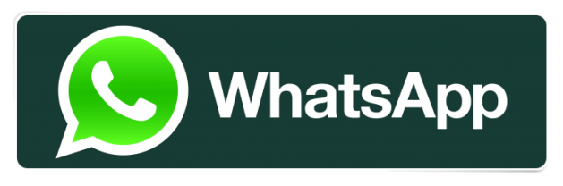
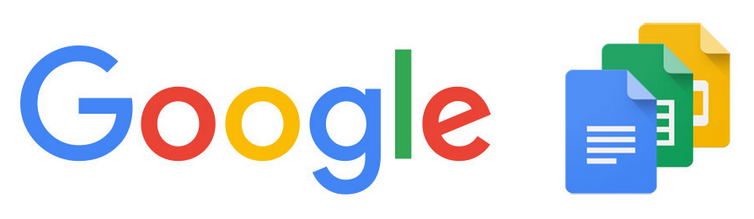
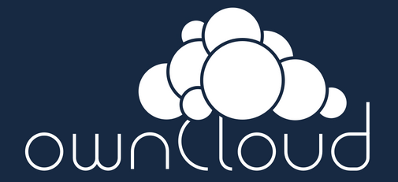

Talk: [BSides] Bugout: practical decentralization on the modern web.

# [bugout.network](https://bugout.network/)


### Practical decentralization on the modern web.

 * chris@mccormick.cx
 * @mccrmx

???

# Setup

Open messageboard server page in a new tab.

Tether to phone internet.

Zoom in on own messageboard page.

# Talk

Hello, my name is Chris. Thanks for coming to listen to me speak today. I'm going to talk about some decentralized web technology I've been experimenting with recently. You can find me and the decentralization work I'm doing at bugout.network. I've got a newsletter there if you want to follow along with what I'm doing in future.

You can also email me directly here or follow me on twitter at mccrmx.

---

# Today's menu

* [Intro & demo](#intro-and-demo)
* [How to build your own](#build-your-own)
* [Why decentralize?](#why-decentralize)
* [What else can we do with this?](#what-else-can-we-do-with-this)
* [Limitations](#limitations)
* [Bugout box announcement](#bugout-box)

???

Here's what I'm going to cover today. I'm going to start with a demo.

---


???

What could possibly go wrong.

---

# Today's menu

* [Intro & demo](#intro-and-demo)
* [How to build your own](#build-your-own)
* [Why decentralize?](#why-decentralize)
* [What else can we do with this?](#what-else-can-we-do-with-this)
* [Limitations](#limitations)
* [Bugout box announcement](#bugout-box)

???

Then I'm going to show you how to build your own stuff using the same tech I've used. Then after looking at the why, I'm going to go off into la la land and create a bunch of vapourware that I think could & should exist, but doesn't. Then I'm going to discuss the limitations, criticisms, and issues with this tech. Then at the end I've got a bit of an announcement.

Ok this is a lot to cover so let's get cracking.

---

# Intro and demo


???

In a few minutes I'm going to show you code that is working, and code that you can use to build decentralized web things yourself, but really this talk is a science fiction talk.

It's about how things could look, and how I hope they will look in the future on the web. I've built some proof-of-concept stuff here to convince myself and others that what I'm about to describe could be real, but widespread adoption of these models of computing has not yet happened.

---

# my living room


???

Now I want to show you something. There is only a single instance of what I'm going to show you in the whole world right now, but I hope to convince you that a lot more people might be running this type of thing in the future, and why that would be a good thing, and how we can make it happen.

This is a photo of a Raspberry Pi sitting in my living room at home right now, just around the corner.

---

<https://chr15m.github.io/bugout/examples/messageboard.html>


???

If you go to this URL you will see a simple messageboard.

A message board back end is pretty simple. Fundamentally a message board service reads some data - the list of posts, and it writes some data - new posts, and it talks to browsers to let people do that. Usually the backend to a piece of web software like this would run on a VPS server out there - a virtual Linux box at some huge data warehousing service provider.

Let's check out this messageboard.

Nothing amazing right? Pretty awful actually, who designed this?

We can type in a message and hit "send" and then see it appear on the board. If we refresh the message is there.

What is a bit different with this particular message board is where that data lives and how the data gets to you, the end user. What is going on here is that my browser, here in this lecture theatre, is connecting peer-to-peer to the message board backend, which isn't running on some cloud VPS somewhere, but rather, is running in my living room, on that raspberry pi.

---

# my living room


???

And further to that, the backend running on this raspberry pi, the server underlying the messageboard, is actually also running in a browser tab, in a browser running on this Pi.

If I scroll down to where "fire up your own copy" I can click on that, and stand up a new messageboard server simply by opening a new browser tab. Now I have a new messageboard server running right here in this room, on my laptop, in this browser tab. And you can connect to this - anyone in this room can put in the address for this new message board running in my browser tab on my laptop, and post a message. Your message won't be stored in the cloud somewhere on somebody else's computer, but right here on my laptop in my browser.

Let's open the client in another tab to see any messages coming in.

My cousin is here today - Nick would you connect and post a message to this server I just started, just to demonstrate it's legit?

---

# what does this mean? 


???

What this means is I have physical sovereignty over the data on the message board. You could do the same kind of thing with SSH tunnels and whatnot, but what I think is really exciting about this is that it really is browser to browser communication. You don't need to be a sysadmin, anybody can visit that tab and create a messageboard server.

I'm interested in the "self-hosting" movement as a model of computing where we go back to users controlling the software they run and the data they store, instead of big corporations.

It's easy for us tech people to run servers on VPS computers and set up SSL certs etc. but I started thinking about what it would take to make that easier for ordinary people. What if you could run web app servers as easily as you run apps on your phone?

---

# what does this mean?


???

What if it was so easy your Mum and Dad could launch their own servers simply by opening a browser tab. What kinds of servers would they run, and what new modes of user-centric computing could we enable?

Instead of Google Calendar could they run their own calendar service? Instead of Dropbox could they run their own file hosting on the web?

---

# Build your own


???

Now you've seen that it's possible to build programs, like our messageboard, which run in the browser and talk to other programs which run in other browsers - peer to peer, browser to browser.

This is made possible because of WebRTC which you have probably heard of, and WebTorrent, which you may not have heard of. My own library, Bugout, is a networking and cryptography layer built on top of WebTorrent. It helps browser nodes find and talk to eachother in a simple and hopefully secure way.

When you torrent things these days you do so based on a cryptographic hash of the files called an infoHash. What Bugout does is to treat those infoHashes as chat rooms, and each Bugout node has its own key pair which they use to cryptographically authenticate each other and encrypt the messages sent between nodes.

---

# Build your own


### "build a decentralized web chat in 15 minutes"

???

So that's enough of the theory, how can you use Bugout to build your own decentralized web things? I'll show you now. This is all documented online and if you do a search for "build a decentralized web chat in 15 minutes" you'll find this.

---

# Build your own

```html
<script
  src="https://chr15m.github.io/bugout/bugout.min.js" 
  type="application/javascript">
</script>
```

???

You start with a basic boilerplate index.html file. The first thing you're going to need is to load the library.

If you are a frontend guru and you know how to use node and webpack and stuff like that you can `npm install bugout` and require it, but here we're going to cover doing this without any tooling, just a text editor and a browser.

---

# Build your own

```javascript
var b = Bugout();
```

???

Once you have the library loaded into your HTML document, you can open a new script tag and create a Bugout instance in JavaScript like this. Every Bugout node has an address which we can ask it for.

---

# Build your own

```javascript
b.address();
```

Example:

```
bKpdPiLJjPmwrYWoZYXVWbJFcEMUpfh6BN
```

???

The address ends up as a Base58 encoded string starting with the letter "b". You might notice this address looks a bit like a Bitcoin address. That's because Bugout uses a similar type of hashing and encoding to create its address from an internal cryptographic keypair. I copied this technique directly from Bitcoin.

When you instantiate a Bugout instance it will start reaching out into the network making itself available to other instances in the same room, using the same room hash. In the instantation above we haven't provided a room to connect to and the default is to connect to a room named after the node's own address.

---

# Build your own

```javascript
var b = Bugout("1337 secret h4x0r room");
```

???

If you want to connect to a room instead you can pass a parameter to the Bugout instance. Here you can see we're instructing our Bugout instance to connect to a room called "elite secret hacker room".

This is a global room and all instances worldwide which use the same room name will connect to the same room.

---

# Build your own

```javascript
b.on("seen", function(address) {
  console.log("seen " + address);
});

b.on("message", function(address, message) {
  console.log(address + ": " + message);
});
```

???

Once your instance is connected it can listen out for messages from other nodes by binding event handlers.

The first callback here will fire whenever a new peer node is seen by our node. The second one will fire whenever a message is received by our node.

Messages can still get through from peers in the same room even if our peer hasn't directly connect to them because there is a gossip protocol whereby nodes in the same room re-share everything they receive. So the network is quite tolerant of indirect connections and poor networks.

---

# Build your own

```javascript
b.send("hello world!");
```

???

Finally you want to be able to send messages.

The `send` method will send a message to all Bugout nodes in browser tabs around the world which are connected to the same room as your node.

That's basically it. These are the simple components that the message board demo is built on and the code you need to get browsers talking to eachother without any internet servers in between. There's a bunch of other stuff Bugout does like RPC, but this is the core functionality it enables, and the main thing which is browsers talking to eachother in a decentralized peer-to-peer way.

---

# Build your own

### "build a decentralized web chat in 15 minutes"

???

Again if you want to go through that quick tutorial in your own time search for "build a decentralized web chat in 15 minutes".

---

# Why decentralize?

???

So that's the how. I've shown you one way to build something for the web in a way that is quite decentralized.

There are a bunch of caveats and limitations and room for improvement that I will get to soon, but before we do that I want to talk about why decentralization even matters, and once we accept that it does matter, what kinds of things we can build with this new superpower.

So the first question is why? Why is this way of doing things good and useful?

You might reasonably argue that it is much easier to build centralized systems and they can be tremendously efficient and cheap. And you'd be right about that. Many of the great utilities people interact with today are centralized systems run by a single entity.

---

# Why decentralize?


Nick Szabo

> "Trusted third parties are security holes."

???

I've been hugely influenced by Nick Szabo on this and he puts it very succinctly. "Trusted third parties are security holes." That's the name of a paper he published in 2001 which you should certainly look up and read.

The basic idea is that any time you have a system which relies on or invokes some trusted third party as part of the design, you're introducing a security hole into your system which can be exploited by attackers.

Some examples of trusted third parties that Nick gives are certificate authorities like Verisign for HTTPS and DNS roots and payment processors like Visa and banks.

And you know, you might argue that banks work fine, and Visa works fine, and DNS and the HTTPS certificate authority system work fine, and you'd be right they work pretty well most of the time for most of us in nice safe places.

---


???

Problem is that the failure mode can be really bad.

---


---


???

Concentration camp bad.

---


---


---


---


---

# Trusted third parties are security holes

???

Fundamentally this is about security. It's about being able to keep the people and things we love safe. Trusted third parties are security holes and systems that invoke new third parties to be trusted will end up expensive to maintain and fragile.

---

# No TTPs

 * Jewellery.
 * Cars & houses secured by keys.
 * Personal computers.
 * SSH.

???

Nick gives some great examples of personal property which is the opposite of this kind of fragility. He says these things historically have not depended and should not depend on trusted third parties.

Jewellery is a store of value that you can literally carry around with you. No trusted third party is required in order for you to carry jewellery and like cash you can exchange it for other goods and serivces.

Cars and houses are secured by a key you hold. You don't need anything other than the key and a tank of petrol to drive. As Szabo points out, even putting locks on your doors is a sensible form of trust minimisation.

Personal computers at the start of the computing revolution were seen by the inventors as this thing that could be completely owned by the user. The owner could learn how to build them, write the code for them, everything, and so no trusted third party was required to run your computer. That was a great model of computing.

He also mentions SSH in the context of a security tradeoff. SSH eschews any centrally trusted third party at the cost of exposing the user to possible man-in-the-middle attacks. As Nick points out, this vulnerability is rarely, if ever exploited, and making this tradeoff has allowed SSH far more widespread use than alternatives requiring trusted third parties.

---

# Social scalability


???

He has this other great idea from his essay "Money, Blockchains and Social Scalability." The idea of Social Scalability is: how many people and how diverse and audience can participate in an institution. He points out that one of the important factors is how "trust minimised" it is.

A Blockchain and BitTorrent are both examples of institutions which have socially scaled to a very high degree and one big reason is that participants do not have to trust eachother or a third party to use them. Both of those systems use decentralization as a part of their inherently trust-minimised design.

---

# Modern issues

 * Social networks.
 * App stores.
 * Software-as-a-service.

???

Let's look at some examples of modern networked things which suffer from this trusted third party problem.

The social networks represent a centralization problem which is getting worse. They are simultaneously censoring important conversations while also being used as conduits for organized influence campaigns. They embody the very worst combination of lack of accountability with inherent corruptability in their design. They require us to trust them, and then almost immediately show that trust to be misplaced.

Is Zuck going to do the right thing? It simply shouldn't matter whether he is or not. A system like this needs to be designed so it doesn't break in a world full of Zucks with their sticky fingers in every crack of the internet.

Another example is app stores and software-as-a-service offerings. Have you ever had a favourite piece of software which you relied upon, all of a sudden disappear or stop working? It's a tremendously frustrating experience.

Well Apple can't yet decide to suddenly revoke your jewellery or your car. Google can't yet shut down your Linux laptop or stop you from SSH'ing to your own server.

The software and networks we use are increasingly controlled by these third parties whom we have to trust not to do the wrong thing, but they do do the wrong thing. They do silence voices that are important for democracy. They are subject to capture by governments and big organisations. They do have corrupt individuals working within them.

---

# Modern issues

## Everything is networked

???

The basic problem with these systems is that today everything is networked together. Your email and chat are not like a piece of jewellery or a car. They rely on the network to function correctly. How do you trust minimise things which rely on a network of connections?

---

# Part of the solution

Decentralization & cryptography.


???

Decentralization and cryptography are part of a tool set we can use to accomplish trust minimisation.

We can use them to build networked systems which are more like jewellery and cars and houses and SSH. Systems which minimise the trust required to use them.

In its own small way this is what Bugout is trying to do. It's a lever that you can use. A tool you can employ to help you build things like that for the web.

---

# Identity

 * Cryptographic addressing.
 * Pubkeys as identity.
 * Cryptographic authentication.

(SSH / Bitcoin model)

???

A fundamental property of the way Bugout works is that of the keypair as a unit of identity.

Instead of passwords on some central server, Bugout nodes find eachother using addresses derived from their pubkey, and authenticate each other using signatures in the same keypair.

What this means is if your node sees another node whos public key it has seen before, it can say with reasonable confidence that it is the same entity it saw before.

I think one reason why SSH and Bitcoin have been so successful is that participating is permissionless. There's no central system to sign up for, you just create key pairs and get cracking.

This is true in Bugout as well. There is no central server to sign up for, you just build stuff. Once you deploy the people who use the system don't have to sign up for anything either if you architect it correctly. All they need is a key pair so nodes in the system can identify and authenticate them consistently.

I should mention that there is still some some centralization in Bugout which I am trying to fix and that I'll get to in a minute, but on the whole this is a trust minimised approach and the cryptographic identity aspect is completely so.

---

# What can we do with this?


???

So what kinds of things can be built? What can we build with cryptography and browsers that talk directly to eachother instead of via an intermediary? And how do we do this with no central servers?

---

# The current model


???

Let's look at how things work in the centralized model.

This is the current dominant model of web applications. The example here is a social networking service. A person who wants to use it must be registered with the service and have a login. Then every time they want to communicate with their followers, their communications have to go through that central authority.

You can see here the logged in user is making a post. The central authority has completely control over the post - they are both the conduit, the storage, and the authenticator for the recipients. The recipients require the central authority and must trust it absolutely to authenticate the sender's post and provide a true and accurate representation.

---

# A decentralized model


???

An alternative model is one that doesn't require a trusted central authority. In this model the poster signs all of their posts with a private key, and that signature, the proof of authenticity is bundled with the post and verified by each receiver. The poster is able to build up a reputation over time and the followers can be reasonably sure that the same entity or person is posting each post. Something which is taken for granted in centralized social networks and conveyed by the presence of an Avatar and username that the central authority attaches to each post.

---

# What is a social network?


???

Social networks are particularly amenible to decentralization. A single person's social network content is a relatively immutable chain of posts to which new posts are appended. Each user has a chain of posts and when you look at the main feed all those streams are just woven together sorted by timestamp.

In the decentralized model each user keeps a copy of their own posts, signed with their key, and they distribute the posts to other users who request them. It's very much like an RSS feed but cryptographically authenticated rather than relying on the URL to verify authenticity. In fact the early Facebook implementation literally published each user's posts as an RSS feed.

There are tricky questions around replies and comments but they are not unsolvable in a fully decentralized model.

---

# Replicated data, protected with cryptography


???

The core idea is that of each user being responsible for their own data, and authenticating that data with cryptography. Because the authentication is all bound up in the data structure itself, users can freely replicate each other's data. For example in a social network I might automatically replicate the posts of the people I follow so that their feeds stay alive while they are offline.

At this point you may be wondering well what happens if all your followers go offline? This is the problem of data storage and availability in a decentralized system and I will get to that in a minute.

---

# What else can we build?






???

Let's quickly look at how some other centralized services could work under a decentralized web model.

With a system like Dropbox you have public and private files. We can encrypt the contents of the private files and use something like WebTorrent to distribute them from browser to browser. The files you decide are public are unencrypted. Or you can do more complicated things like encrypting a subset for some subset of pubkeys. For example the pubkeys in your team on a project could decrypt some set of files but nobody else.

Whatsapp is pretty much like the social network example above, but simpler. Instead of sending signed and encrypted messages via Whatsapp's servers, you're sending them directly from one client to the other and both sides can store a copy of the conversation.

What if you're building something like Google Docs with multiple writers to the same document? That's difficult without a central server. Multiple parties sending change sets to each other.

If you want to do these types of more complicated things, CRDTs and operational transformations can help you. These are algorithms which let you choose how to resolve conflicts which arise during merges. This is almost always application specific and involves different tradeoffs for different requirements.

However, many things don't need this level of complexity. Often if you reign in your feature set a little you can get away with single-writer solutions like our social networking post example before.

---

# Existing models of decentralization





???

Obviously many people have been thinking about and hacking on alternatives to centralized services for some time. You have social networks like Diaspora, Mastodon, GNU Social. Chat systems like Matrix. You have people doing weird things with Blockchains. You have self-hosting movements and platforms like OwnCloud and Sandstorm.io. You have XMMP and Activity Pub and Open Social and RSS and Atom.

In the distributed social network space most existing systems have adopted a federated model and are part of this idea of the fediverse. This works a lot like Email which is one of the most successful ecosystems and despite its huge problems its still used by nearly everybody. It seems simpler to manage identity and security if these things are tied to a server.

The problem is that Mum and Dad can't run their own Matrix or Mastodon server and have to know and trust some nerd to run it for them. These systems are great and worthwhile, but not as trust-minimised and socially scalable as they could be.

---

# Limitations

* WebRTC centralization
* Crypto in the browser
* Key management
* Where to store the data?

???

Now I'd like to discuss some issues, criticisms, constraints, and potential security problems with the decentralized web. I think it's important to be quite critical when you're building something new, and to be honest about the shortcomings. The only way you can fix and improve something is to find out what is wrong with it.

---

# WebRTC centralization

* TURN
* STUN
* Signaling

???

First of all let's look at some of the problems with WebRTC.

WebRTC is an amazing piece of engineering. They solved multiple very difficult problems at the same time including video and audio streaming, network address translation and hole punching, and some cryptography stuff thrown in there, all inside the browser. It's a miracle but they had to make some centralizing compromises to get it working.

When you start using WebRTC you notice that it uses central servers to get around the issue of discovery. First of all there is STUN and TURN which are protocols that your browser uses to find its network pathway to another browser. The issue here is that most implementations actually just use Mozilla and Google servers, or maybe some other server run by a trusted third party.

It's not that bad because it only happens at the connection phase and the important stuff is encrypted, but still if those big organisations decide they don't want to provide this service any more all the applications break.

Next we have WebRTC signaling. When the browsers have a pathway they can use to connect they have to negotiate that connection. Again this is only at the connection stage. Once two browsers are connected the communication is direct from browser to browser. Again this signaling phase requires you run some centralized server where the browsers can find eachother.

Bugout unfortunately has to do this and I am personally running a WebTorrent signalling server which all Bugout instances connect to in order to make contact. I don't like this.

I don't really want that responsibility of being a trusted third party when it comes to the signaling part. Fortunately I think I have come up with a pretty good way of decentralizing WebRTC signaling which I am working on right now. So hopefully in future I'll be able to say that the second and third points here are solved and we really do have a very robust and full decentralized system.

In the meantime though, aside from the signalling and negotiation it is great that the traffic itself goes direct.

---

# Crypto in the browser


???

I mean what can you say about this. The browser is awful and everybody knows it's awful. The number of ways of exfiltrating data from somebody's browser tab is insane. Cross site scripting, piggybacking data on CSS font requests, you name it. Browsers leak.

On the whole browser tabs are tight sandboxes in your computer. You need to ask the user to do anything like accessing camera hardware, microphone etc. and forget about file system access. The problem is not gaining access out of the tab but leaking the stuff that is inside those tabs back out to the network.

I don't think this issue is insurmountable. I think there are tradeoffs to be found where you can rotate the keys that are inside the tab and use more secure devices to store your long term keys and have key chains and stuff like that. Basically these are user interface innovations where you try to make it both sane and safe for the user.

For the stuff I am building at the moment the keys are right there inside the tab. The user can copy and paste private keys right in there. It's experimental and hashtag-reckless and hopefully I am communicating the nature of that correctly.

---

# Crypto in the browser


???

The other thing to ask is "is it better than the alternative"? Is it worth taking a bit of a risk to build some new models and let people experiment with being responsible for their own data and keys, given that the existing password based central authority systems are so so broken?

---

# Key management is hard


???

Key management is hard. Again I think this is really fertile space for user interface innovation. I think Bitcoin has seen some very exciting developments with hardware wallets and multi-party signatures and web interfaces and stuff and I hope there is more. People increasingly need good, sane, user-friendly key management so hopefully this will get better.

---

# Where to store the data?


???

Now I want to get back to this very important question.

Before when I was doing that handwavey summary of how we can decentralize everything on the web, I glossed over the problem of where the data is stored and specifically what happens when the user goes offline.

If all your social network posts and your shared files are literally inside your browser tab and you close the browser tab and go to sleep, how does somebody else see the posts?

People are proposing a couple of main solutions to this problem.

---

# Where to store the data?

## muh blockchain

???

First is the blockchain. People are saying that the blockchain is this amazing data structure that is there all the time. Why not use it to store other stuff?

Fundamentally it won't work. The blockchain design makes a tradeoff which is horrific computation and space inefficiency for a very high level of auditable immutability. Security for efficiency.

It is not designed to store a lot of data. In fact doing so breaks some of the fundamental assumptions like having a lot of people participate by running full nodes.

This is incidentally also why Ethereum is probably heading for very bad times. This does not constitute investment advice. Do your own research.

---

# Where to store the data?

## other peoples computers

???

IPFS and other projects have a particular way of solving this which is to say the internet is a giant hard drive and we can all share and shard everybody's data across it.

---


???

I don't like this idea becuase I don't like other people or their computers.

They're not going to shard my data for me. They're going to try it once, see all their hard drive space getting used up and their computer grinding and say no thanks.

People are trying to fix that broken design by invoking a coin or token to pay for the storage but I don't think that approach will take off. Apart from cryptocurrency no app token or ICO has ever worked.

---

## Why do people put stuff in "the cloud"?


???

Let's take a step back and ask ourselves, why do people use "the cloud"? Why do people opt for Gmail instead of running their own mail server? Why do they opt for Dropbox instead of keeping something on a NAS in their house?

They run Gmail because running your own mailserver is a flat out nightmare. I'm a computer professional with decades of experience and I find it a nightmare.

Then there's the nice UIs and the convenience of having it all taken care for you.

That seems to be the tradeoff people are making. They're saying "you can have all my data because you make it easy and friendly for me to access and share and work with that data."

And so is there any question that if people were given a credible alternative they would continue doing such a dumb thing as keeping their important stuff with some untrustworthy third party?

If they were able to store and share and work on their data in a nice easy way but without giving it to somebody else, wouldn't they do that?

---

# Where to store the data?

## Our own computers?

???

To my mind the real solution is to give people a way to do it themselves.

People carry around supercomputers in their pockets that are always connected to the network. Store the data there. They have super computers at home in their kitchen. Store the data there too. Store and serve the data from all of the devices they own in a cryptographically authenticated and secure way.

---

# Where to store the data?


???

Here's that Raspberry Pi from the start of the talk.

If you gave a box like this to somebody and said "you can put your files on here and then you can reach them from anywhere in the world and share them with whoever you like. Oh and it also runs apps and nice interfaces like the stuff you're used to, but completely controlled by you. Your calendar can go on there, and your blog, and your private family whatsapp type of chats."

Instead of saying "your data will waft off into the cloud" you say to them "your data and apps will be right here on this device in your physical possession, and you can reach it from anywhere in the world."

Do you think that would be a compelling offering?

I mean, I'm seriously asking you this. A tiny little box you can keep at home or in your office and it does the same basic thing that Dropbox and Gmail and iCal and Whatsapp and Google Docs do.

Raise your hand if that sounds like something that makes sense to you; something that you would like as a mode of computing.

---

# The Bugout Box


???

Well good news everyone! This is exactly what I've been hacking on. This is the Bugout Box. It's a decentralized web appliance.

It's a box, a Raspberry Pi fully configured, which you plug into your network at home or in your office, and then you can connect to it from anywhere in the world.

---


???

I call it a "decentralized web appliance" because it is a one-stop device for doing decentralized web stuff.

It runs Bugout server applications like the messageboard I showed you and it can also host and serve files to the web using WebTorrent.

You can build your own stuff to run on it pretty easily using the same code I showed you at the start of the talk. You can build servers a bit like building web pages.

You could build the next Dropbox or Whatsapp which runs on this.

---


# [bugout.network/box](https://bugout.network/box)

???

Right now it's very beta and hashtag-reckless, and I can only make a small number of these, but I think that this could be a part of the future. I think this could become a way for people to run apps and store their data in a decentralized way without having to trust third parties.

It's open source, and I'm producing and selling a few of them with everything you need to get set up and start hacking.

If that sounds good to you and you want to support this work, you can get on the pre-order list by heading to bugout.network/box and signing up, and I'll put you on there.

---

# Thanks for listening
## and please break this


???

My final slide is a request to you people here in this room to help break this. As I said before I strongly beleive that you can't make something better and more secure without testing it and uncovering the flaws. So if you want to help, another way to do that is to see if you can break into that raspberry pi running the message board in my living room, and then let me know how you did it, so I can fix it.

---

# [bugout.network](https://bugout.network/)

 * chris@mccormick.cx
 * @mccrmx

???

Finally, you can stay updated with what I am working on at bugout.network - feel free to email me or get in contact on Twitter if you'd like to discuss.

Enjoy the rest of the conference, and thank you very much for having me here today.